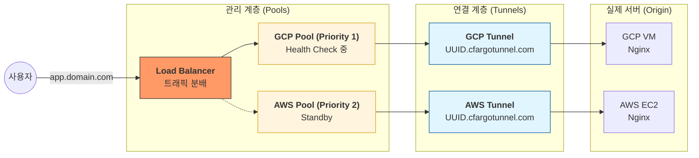

# Cloudflare Tunnel vs. LB Pool: 역할과 차이점 이해하기

본 가이드는 현재 프로젝트 코드에서 사용 중인 **Cloudflare Tunnel**과 **Load Balancer Pool**이 각각 어떤 역할을 하며, 왜 두 가지가 모두 필요한지 설명합니다.

---

## 1. 핵심 요약: "연결" vs "관리"

| 구분 | Cloudflare Tunnel (터널) | Load Balancer Pool (풀) |
| :--- | :--- | :--- |
| **비유** | 서버와 외부를 잇는 **"전용 고속도로"** | 입구에서 어디로 갈지 정하는 **"행선지 그룹"** |
| **주요 역할** | 공인 IP 없이 서버를 안전하게 노출 | 여러 서버 중 상태가 좋은 곳으로 트래픽 분산 |
| **코드 위치** | `cloudflare_zero_trust_tunnel_cloudflared` | `cloudflare_load_balancer_pool` |
| **결과물** | `UUID.cfargotunnel.com` 주소 생성 | 해당 주소들을 하나의 그룹으로 묶음 |

---

## 2. Cloudflare Tunnel (연결의 핵심)

터널은 서버와 Cloudflare 네트워크 사이에 암호화된 통로를 만드는 기술입니다.

- **왜 쓰는가?**
    - 방화벽에서 인바운드 포트(80, 443 등)를 열 필요가 없습니다.
    - 서버의 실제 공인 IP가 외부에 노출되지 않아 보안에 탁월합니다.
- **코드에서의 역할:**
    ```hcl
    # 터널 생성: 서버에 설치된 cloudflared가 이 정보를 이용해 접속합니다.
    resource "cloudflare_zero_trust_tunnel_cloudflared" "gcp_tunnel" { ... }

    # 터널 설정: 터널로 들어온 트래픽을 서버 내부의 어디(예: localhost:80)로 보낼지 결정합니다.
    resource "cloudflare_zero_trust_tunnel_cloudflared_config" "gcp_config" { ... }
    ```
- **결과:** 각 터널은 고유한 가상 주소(`...cfargotunnel.com`)를 가지게 되며, 이 주소는 아직 일반 사용자가 접속하는 최종 주소는 아닙니다.

---

## 3. Load Balancer Pool (관리의 핵심)

풀은 하나 이상의 오리진(Origin, 여기서는 터널 주소)을 논리적으로 묶어주는 단위입니다.

- **왜 쓰는가?**
    - **상태 체크(Health Check):** 풀에 속한 서버가 살아있는지 주기적으로 확인합니다.
    - **장애 조치(Failover):** 메인 서버(GCP)가 죽었을 때 백업 서버(AWS)로 트래픽을 즉시 넘기기 위해 필요합니다.
- **코드에서의 역할:**
    ```hcl
    resource "cloudflare_load_balancer_pool" "gcp_pool" {
      name    = "gcp-main-pool"
      origins {
        name    = "gcp-origin"
        # 위에서 만든 터널의 가상 주소를 '목적지'로 사용합니다.
        address = "${cloudflare_zero_trust_tunnel_cloudflared.gcp_tunnel.id}.cfargotunnel.com"
      }
    }
    ```

---

## 4. 시각화: 트래픽 흐름도

사용자가 도메인에 접속했을 때 트래픽이 어떤 단계를 거쳐 서버까지 도달하는지 보여줍니다.



---

## 5. 결론: "터널을 통해 길을 뚫고, 풀을 통해 길을 관리한다"

1.  **Tunnel**은 서버를 클라우드플레어 네트워크에 **"연결"**하는 최소 단위입니다.
2.  **Pool**은 그 연결된 포인트들을 **"상태 감시"**하고 **"그룹화"**하는 단위입니다.
3.  마지막으로 **Load Balancer**가 이 풀들 사이의 우선순위를 정해 사용자에게 최종 서비스를 제공합니다.

현재 코드에서 GCP와 AWS를 각각 별도의 풀로 나눈 이유는, 한 쪽 클라우드 전체에 장애가 발생하더라도 다른 클라우드 풀로 트래픽을 즉시 전환(Failover)하기 위함입니다.
