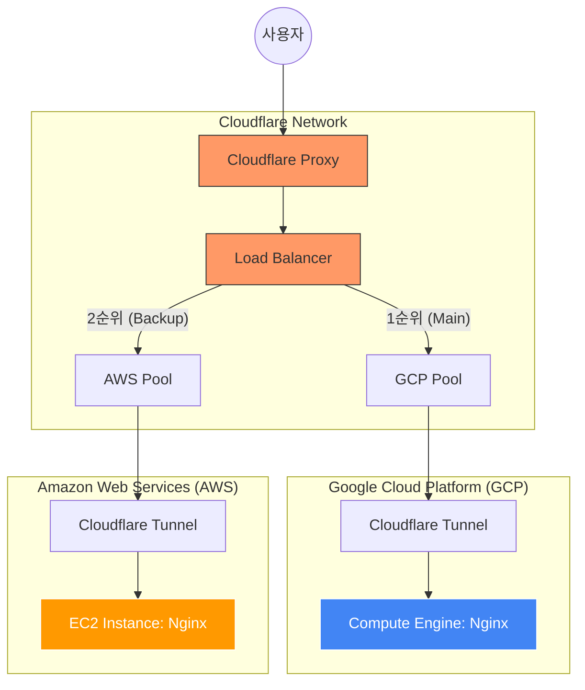
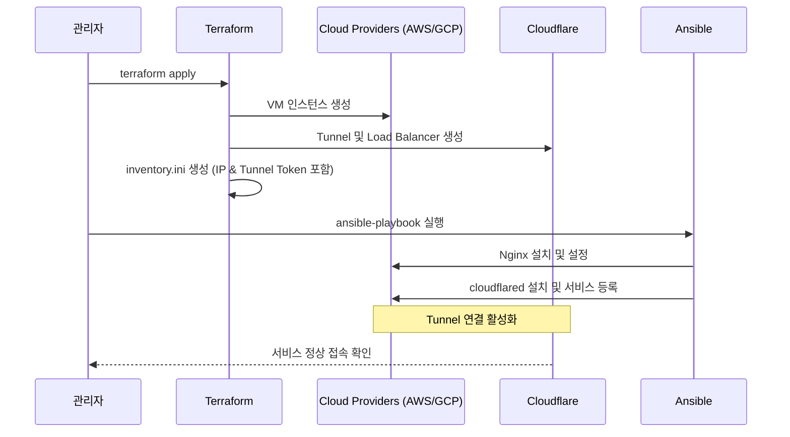

# Cloudflare & Multi-Cloud Infrastructure Guide

이 문서는 AWS와 GCP를 활용한 멀티 클라우드 환경에서 Cloudflare Tunnel과 Load Balancer를 설정하고 운영하는 방법에 대해 설명합니다.

## 1. 시스템 아키텍처

본 프로젝트는 Cloudflare의 **Zero Trust Tunnel** 기술을 사용하여 공인 IP 노출 없이 내부 서버를 안전하게 외부로 노출하며, **Load Balancer**를 통해 다중 클라우드 간의 트래픽을 제어합니다.



## 2. 배포 워크플로우

인프라 구축부터 서비스 배포까지의 과정은 Terraform과 Ansible을 통해 자동화되어 있습니다.



## 3. 주요 구성 요소 설명

### Cloudflare Tunnel (Zero Trust)
- **보안성:** 서버에 인바운드 포트(80, 443 등)를 열 필요가 없습니다. 서버에서 Cloudflare로 아웃바운드 연결만 수립합니다.
- **설정:** `terraform/main.tf`에서 터널을 정의하고, Ansible을 통해 각 서버에 `cloudflared`를 설치하여 실행합니다.

### Cloudflare Load Balancer
- **Traffic Steering:** GCP를 메인 풀(Main), AWS를 서브 풀(Sub)로 구성하여 우선순위 기반의 Failover를 지원합니다.
- **Health Check:** `cloudflare_load_balancer_monitor`를 통해 60초 간격으로 서버 상태를 체크합니다. 터널을 통과하기 위해 필수적으로 `Host` 헤더를 지정하도록 설정되어 있습니다.

### Infrastructure as Code (IaC)
- **Terraform:** 서버(VM), 네트워크(SG), Cloudflare 리소스(Tunnel, LB, DNS)를 생성합니다. 실행 결과로 생성된 IP와 터널 토큰을 `ansible/inventory.ini`에 자동으로 기록합니다.
- **Ansible:** 실제 서버 내부 설정을 담당합니다. Nginx 웹 서버를 구성하고 `cloudflared` 서비스를 등록하여 터널을 활성화합니다.

## 4. 실행 방법

### 사전 준비
1. Cloudflare API Token, Account ID, Zone ID 준비
2. AWS/GCP 자격 증명(Credentials) 설정
3. `terraform/terraform.tfvars` 파일 작성 (example 파일 참고)

### 단계별 실행

#### Step 1: 인프라 생성 (Terraform)
```bash
cd terraform
terraform init
terraform apply
```
*실행 완료 시 `ansible/inventory.ini` 파일이 생성됩니다.*

#### Step 2: 서버 환경 설정 (Ansible)
```bash
cd ../ansible
ansible-playbook -i inventory.ini deploy-tunnel.yml
```

## 5. 주요 파일 구조
- `/terraform/main.tf`: 전체 리소스 정의 (AWS, GCP, Cloudflare)
- `/ansible/deploy-tunnel.yml`: Nginx 및 Cloudflared 설치 자동화
- `/ansible/inventory.ini`: (자동 생성) 배포 대상 서버 리스트 및 토큰 정보

---
*문의 사항은 인프라 팀으로 연락 바랍니다.*
